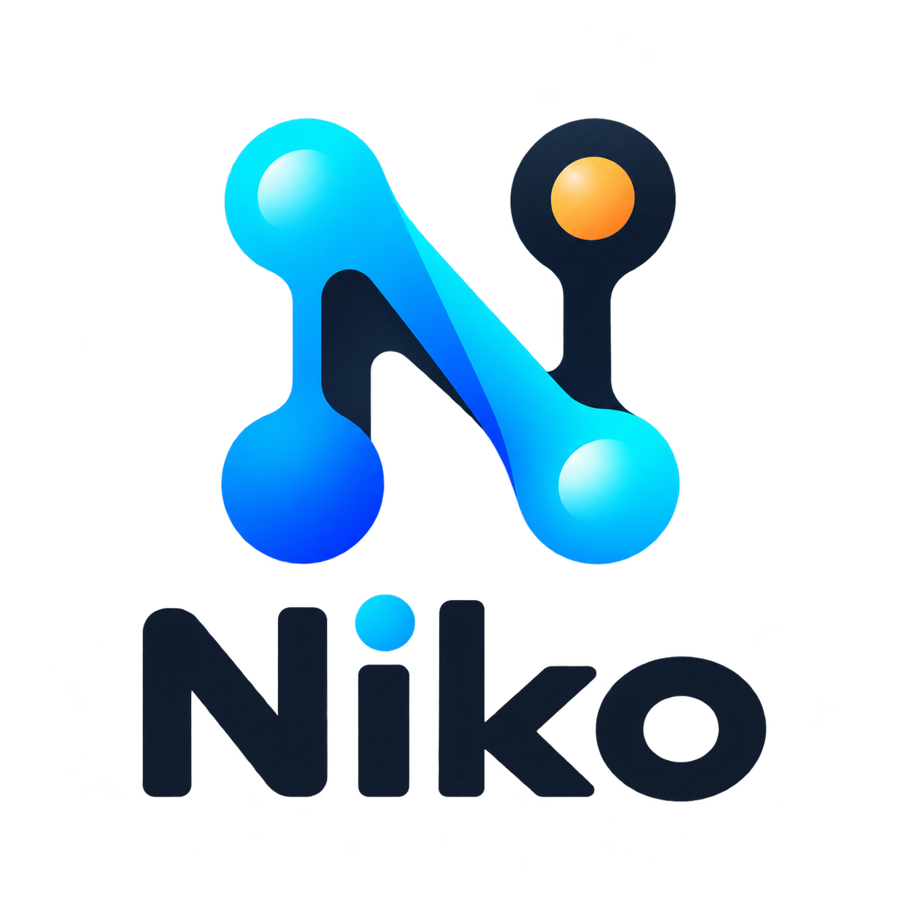

# Niko Agent



Bot Telegram nhỏ gọi Claude CLI (`fcc-claude`) để anh em trong group chat thử với Niko.

## Chạy local

1. Tạo bot bằng [@BotFather](https://t.me/BotFather), lấy token.
2. Copy `.env.example` thành `.env`, điền:

**Chú ý:** Cần cài Free Claude Code/FCC (đã cấu hình và điền API Key NVIDIA) và chạy `fcc-server` trước nếu `fcc-claude` đang trỏ qua FCC.

```env
TELEGRAM_BOT_TOKEN=token_cua_bot
TELEGRAM_ALLOWED_CHAT_IDS=-100xxxxxxxxxx
CLAUDE_CLI_COMMAND=fcc-claude -p
```

3. Chạy bot:

```bash
python bots/telegram_bot.py
```

Dùng `/id` trong private chat hoặc group để lấy `chat_id`. Nếu bot chạy trong group thì điền `chat_id` của group.

## Nhận Diện Người Chat

Dùng `/whoami` hoặc `/id` để lấy `user_key` của từng người. Bot sẽ gửi thông tin người nói vào prompt để Claude biết ai đang chat.

```env
CHAT_IDENTITY_ENABLED=1
CHAT_ALLOWED_USER_KEYS=
CHAT_USER_ALIASES=telegram:123456789=Anh A;telegram:987654321=Anh B
```

`CHAT_ALLOWED_USER_KEYS` để trống thì ai trong chat được phép cũng dùng được bot. Nếu muốn giới hạn theo từng người, điền danh sách `user_key`, cách nhau bằng dấu phẩy.

## Giữ phiên Claude

Bot có thể tiếp tục phiên gần nhất nếu context chưa tới 80%:

```env
CLAUDE_SESSION_MODE=auto_resume
CLAUDE_RESUME_COMMAND=fcc-claude --continue -p
CLAUDE_CONTEXT_USAGE_COMMAND=fcc-context --json
CLAUDE_CONTEXT_LIMIT_PERCENT=80
CLAUDE_CONTEXT_WINDOW_TOKENS=1000000
CLAUDE_NEW_SESSION_COMMAND=
```

Chạy `powershell -ExecutionPolicy Bypass -File scripts/install_fcc_context_command.ps1` một lần để có lệnh `fcc-context`. Với Opus 5/`opus[1m]`, để window là `1000000`.

Khi context chạm ngưỡng, bot sẽ báo lên chat rồi mở phiên mới bằng `fcc-claude -p`. Nếu máy có command `fcc-resume` riêng thì điền vào `CLAUDE_NEW_SESSION_COMMAND`.

## Hai Agent

Bật `TELEGRAM_AGENT_MODE=two_agent` để bot phản hồi ngay: câu đơn giản được Agent nhanh xử lý, câu cần phân tích sẽ chạy deep agent ở background nên Telegram vẫn nhận được tin mới trong lúc chờ Opus 5.

```env
TELEGRAM_AGENT_MODE=two_agent
TELEGRAM_FAST_AGENT_COMMAND=
TELEGRAM_FAST_AGENT_TIMEOUT_SECONDS=45
TELEGRAM_UNCERTAIN_DELAY_SECONDS=3
TELEGRAM_DEEP_WAIT_REPLY=Da anh doi em chut, cau nay can phan tich ky hon nen em day sang Opus 5 roi bao lai anh ngay.
TELEGRAM_DEEP_BUSY_REPLY=Da anh doi em chut, em van dang xu ly cau truoc. Anh cu nhan tiep, khi co ket qua em se gui lai.
```

Để `TELEGRAM_FAST_AGENT_COMMAND` trống thì Agent nhanh chỉ dùng rule local như chào hỏi, cảm ơn, ping, ok hoặc câu khen ngắn. Câu không rõ local/deep keyword sẽ chờ `TELEGRAM_UNCERTAIN_DELAY_SECONDS` giây rồi mới báo chờ và đẩy sang deep agent. Khi có model nhẹ hơn, điền command vào biến này; deep agent vẫn dùng nhóm cấu hình `CLAUDE_*` hiện tại.

## Sửa hook

Muốn đổi giọng văn thì sửa file `HOOK.md` rồi mở PR, không cần sửa script Python.

```env
TELEGRAM_PROMPT_HOOK_MODE=new_session
TELEGRAM_PROMPT_HOOK_FILE=HOOK.md
TELEGRAM_REPLY_SUFFIX=Meow
```

Mặc định `new_session` chỉ nạp `HOOK.md` khi mở phiên mới/stateless. Khi resume chat cũ, bot không gửi lại hook để tiết kiệm context; đổi thành `always` nếu muốn ép nạp mỗi tin.

## Sticker Ducks

Bot có thể gửi thêm sticker Duck của Telegram (UtyaDuck) theo mood bằng local picker, không cần MCP.

```env
TELEGRAM_STICKERS_ENABLED=1
TELEGRAM_STICKER_CONFIG_FILE=stickers/ducks.json
TELEGRAM_STICKER_SET_NAME=UtyaDuck
TELEGRAM_STICKER_MODE=smart
```

Sửa keyword/emoji trong `stickers/ducks.json` nếu muốn đổi cách chọn sticker. `smart` chỉ gửi khi bắt được mood; đổi thành `always` nếu muốn câu nào cũng có sticker.

## Demo file prompt

```bash
python main.py
```

Script đọc `examples/input.txt`, gọi `fcc-claude`, rồi ghi kết quả vào `output.txt`.

## PR

Tạo branch riêng, sửa hook/code, mở Pull Request vào `main`. `main` là nhánh chính và owner sẽ duyệt/merge.
