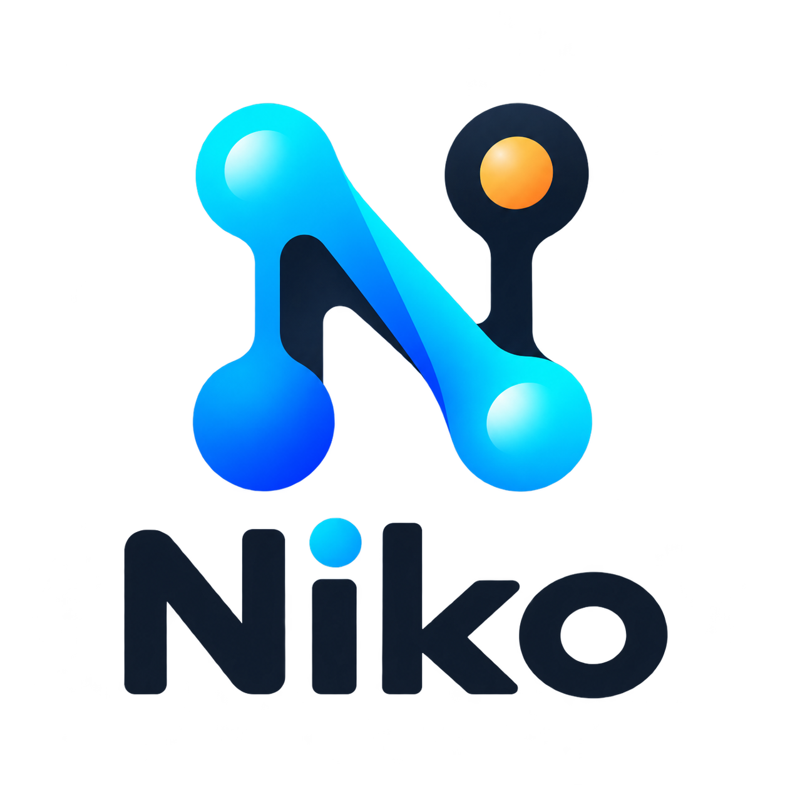

# Niko Agent



Niko Agent là một AI agent harness chạy local. Repo này tập trung vào việc có một hệ thống chạy thật để quan sát luồng agent, ghi trace, lưu memory cơ bản, rồi dùng baseline đó làm nền cho hướng cải tiến Semantic/Episodic Memory.

Điểm quan trọng: Niko không gọi trực tiếp API LLM trong code. Runtime hiện tại gọi Claude CLI/FCC qua `fcc-claude` trên máy local.

## Niko Hiện Có Gì

- Telegram gateway: nhận/gửi tin qua Telegram, hỗ trợ group mention, `/id`, `/whoami`, allowlist, sticker.
- Two-agent chat flow:
  - Fast agent: phản hồi nhanh, triage, hoặc compose câu trả lời cuối.
  - Deep agent: xử lý tác vụ cần suy nghĩ lâu hơn qua `fcc-claude`.
- Harness tracing: ghi JSONL event theo từng turn.
- SQLite memory baseline:
  - `chat_log`: lịch sử hội thoại đã xử lý.
  - `facts`: Semantic Memory thủ công hoặc tạo từ consolidation bảo thủ.
  - `episodes`: Episodic Memory sinh ra sau deep job.
  - recent working memory, retrieval/write/correction gate và consolidation scaffold cho các bước memory tiếp theo.
- Mini Niko Ops dashboard: xem live harness graph, trace, chat log, memory; thêm/xóa facts; chỉnh runtime config; start/stop bot và xem runtime log.
- Memory consolidation: Memory tab có thể preview/run thủ công một batch `chat_log`; nếu bật config auto, Niko tự chạy nền sau khi đủ số exchange hoàn tất.

## Cấu Trúc Chính

```text
bots/telegram/                  # Telegram gateway
bots/decision_model/            # Ollama/Nimble decision scripts cho triage, sticker, memory/Jira gates
niko/chat_gateway.py             # Chuẩn hóa message thành ChatGatewayMessage
niko/graphs/chat_reply/          # Router, Fast/Deep handoff, final compose
niko/graphs/jira_issue/          # Jira issue context flow V0 qua Loop tools
niko/runtime.py                  # Gọi fcc-claude, nạp hook, inject identity/memory
niko/harness/trace.py            # Trace JSONL theo turn
niko/harness/runtime_log.py      # Runtime log JSONL cho tab Bots
niko/loop/                       # Loop core V0: ToolRegistry, LoopRuntime, observer
niko/memory/store.py             # SQLite memory store
niko/memory/runtime.py           # Khung điều phối retrieval/write/correction/consolidation
niko/memory/context.py           # Dataclass, formatter và wrapper tương thích
niko/memory/working_memory.py    # Recent conversation window cho Deep/correction
niko/memory/correction_workflow.py # Workflow sửa/xóa fact qua chat
niko/memory/correction_loop.py   # Bridge correction default-off qua LoopRuntime + fact tools
niko/memory/consolidation.py     # Scaffold gom chat_log thành batch consolidation
niko/tools/memory/facts.py       # Fact tool adapters cho Loop core V0
niko/tools/jira/issues.py        # Jira fixture tools read-only cho Loop core V0
niko/ops/                       # Mini Niko Ops dashboard
  dashboard.py                   # HTTP server/entrypoint mỏng
  bots.py                        # Start/stop Telegram Bot, warmup/stop Decision Model
  config_schema.py               # Schema, validate, mask runtime config
  frontend.py                    # Load template dashboard
  templates/dashboard.html       # HTML/CSS/JS dashboard
niko/HOOK.md                     # Persona/hook của Niko
niko/.runtime/                   # Runtime state, không commit
docs/                            # Tài liệu kiến trúc, flow, demo, roadmap
```

## Chạy Nhanh

1. Cài và cấu hình FCC/Claude CLI để lệnh `fcc-claude` chạy được.
2. Cài Ollama, bật Ollama server, rồi pull model Nimble dùng cho decision triage:

```bash
ollama pull nimble
```

Nếu anh dùng tag khác, ví dụ một bản quantized cụ thể, đổi model trong dashboard tab `Config -> Decision Model`.

3. Copy bootstrap env tối thiểu nếu cần đổi host/port/path config:

```bash
copy .env.example .env
```

4. Chạy dashboard trước:

```bash
python -m niko.ops.dashboard
```

Dashboard mặc định: `http://127.0.0.1:7777`

5. Trong dashboard:

- Tab `Config`: nhập `TELEGRAM_BOT_TOKEN`, allowlist, command Claude/Fast, Nimble, sticker, memory và reply text.
- Tab `Bots`: bấm `Warmup` cho Decision Model, rồi `Start` Telegram Bot.
- Tab `Bots` cũng có bảng runtime log thay cho các dòng log trước đây trên terminal.

Telegram Bot có single-instance lock ở `niko/.runtime/telegram_bot.lock`. Nếu anh
đang chạy bot bằng terminal, dashboard sẽ hiện trạng thái `external` và chặn
`Start` để tránh lỗi Telegram `409 Conflict`.

6. Lấy `chat_id` và `user_key` bằng `/id` hoặc `/whoami`, rồi cập nhật allowlist trong `Config` nếu cần.

Runtime config và secret local được lưu ở `niko/.runtime/config.json`; thư mục này đã bị gitignore.

Anh có thể chỉnh cấu hình theo hai cách:

- Qua dashboard tab `Config`, đây là cách an toàn nhất vì secret được mask và input được validate.
- Sửa trực tiếp `niko/.runtime/config.json` khi cần thao tác nhanh. File là JSON object key/value string; sau khi sửa, restart Telegram Bot trong tab `Bots` để các process đang chạy đọc lại các key liên quan tới startup như token, command, allowlist.

## Cấu Hình Tối Thiểu

Dashboard là source chính cho cấu hình vận hành. `.env` chỉ còn bootstrap dashboard hoặc override khẩn cấp:

```env
NIKO_OPS_HOST=127.0.0.1
NIKO_OPS_PORT=7777
NIKO_RUNTIME_CONFIG_FILE=niko/.runtime/config.json
```

Các nhóm nên chỉnh trong dashboard:

- `Telegram Gateway`: token, allowlist, group mode, timeout/retry.
- `Agent Commands`: `CLAUDE_CLI_COMMAND`, `CLAUDE_DEEP_AGENT_COMMAND`, `NIKO_FAST_AGENT_COMMAND`, timeout và hook file.
- `Decision Model`: Ollama base URL, model Nimble, timeout triage, timeout warmup/stop, keep alive.
- `Sticker`: sticker set/config/mode và timeout.
- `Memory & Trace`: memory, recent context budget, retrieval/write/correction gate, auto consolidation, trace và runtime log.
- `Replies`: suffix, wait/busy/error reply.

Trước khi chạy bot, Ollama phải đang bật và model trong `NIKO_DECISION_MODEL_NAME`
phải pull sẵn trên máy. Nút `Warmup` trong dashboard chạy nền với
`NIKO_DECISION_MODEL_WARMUP_TIMEOUT_SECONDS` riêng, vì lần load đầu có thể lâu
hơn timeout triage thường. Lệnh warmup dưới đây dùng cùng timeout warmup và gửi
`keep_alive=-1`, nên model được giữ loaded cho tới khi anh unload model hoặc tắt Ollama:

```bash
rtk python -m bots.decision_model.warmup
ollama ps
```

Nếu muốn gỡ Nimble khỏi RAM/VRAM nhưng vẫn giữ Ollama chạy, bấm `Stop` ở
`Bots -> Decision Model` hoặc dùng:

```bash
ollama stop nimble
ollama ps
```

Nếu bot vẫn đang chạy và `NIKO_DECISION_MODEL_KEEP_ALIVE=-1`, lần chat tiếp theo
cần decision model có thể load Nimble lại. Muốn tắt hẳn decision model thì đổi
trong dashboard tab `Config -> Decision Model`, rồi restart bot ở tab `Bots`:

```env
NIKO_DECISION_MODEL_ENABLED=0
TELEGRAM_STICKER_DECISION_MODEL_ENABLED=0
```

Sticker Telegram dùng Nimble local để chọn mood sau khi text reply đã gửi. Nếu
Nimble chọn `no_sticker` hoặc lỗi/timeout, bot chỉ bỏ qua sticker và không
fallback về keyword rule cũ.

Niko không còn dùng `niko/.env` hoặc `bots/telegram/.env`. Nếu các file đó xuất
hiện lại, hãy coi là legacy và xóa đi. Dashboard chỉ nạp root `.env` để bootstrap
`NIKO_OPS_HOST`, `NIKO_OPS_PORT`, `NIKO_RUNTIME_CONFIG_FILE`; khi start bot con,
dashboard bỏ các key đọc từ `.env` để bot đọc cấu hình từ runtime config.

Thứ tự cấu hình hiệu lực: OS env thật -> `niko/.runtime/config.json` do tab
Config ghi -> root `.env` bootstrap -> default trong code. Nếu một key bị OS env
khóa, dashboard vẫn hiển thị nhưng không ghi đè được.

## Demo Baseline

Các kịch bản demo nhanh:

- Gửi `@Niko2_Bot em ơi`: route local/fast, dashboard sáng tuyến `Gateway -> Router -> Reply` hoặc `Gateway -> Router -> Fast Agent -> Reply`.
- Gửi câu có `fact`, `memory`, `phân tích`, `debug`: route deep, dashboard sáng `Memory Gate -> Loop -> Reply`.
- Thêm một fact trong dashboard, hỏi câu liên quan: Deep agent nhận memory context từ SQLite.
- Yêu cầu Niko quên/sửa fact test: correction gate hỏi lại khi mơ hồ và chỉ update/delete khi đã rõ ID.
- Bật `NIKO_JIRA_TOOLS_ENABLED=1`, hỏi `phân tích NIKO-101`: graph dùng Jira Loop
  tools đọc fixture, đưa context có evidence sang Deep và hiện Loop Steps trong Traces.
- Bật thêm `NIKO_JIRA_DECISION_GATE_ENABLED=1` để Nimble xử lý prompt Jira mơ hồ
  như `xem ticket vừa nãy`; issue key rõ vẫn đi rule Python cho nhanh và chắc.
- Mở tab Traces để xem `turn_start`, `route_decision`, `memory_retrieval`,
  `memory_gate_decision`, `memory_write_decision`, `memory_correction_decision`, `turn_end`.
- Mở tab Bots để xem runtime log như `telegram_message_processed`, `fast_triage_finished`, `sticker_decision`.

Chi tiết hơn xem [docs/demo/demo-guide.md](docs/demo/demo-guide.md).

## Tài Liệu

- [Kiến trúc](docs/harness/architecture.md)
- [Luồng chat Telegram](docs/harness/telegram-chat-flow.md)
- [Harness Memory & Ops](docs/harness/memory-ops.md)
- [Chat Memory Eval Scenarios](docs/harness/memory-eval-scenarios.md)
- [Niko Loop Architecture](docs/loop/architecture.md)
- [Nghiệp vụ harness](docs/business-domains/README.md)
- [Demo Guide](docs/demo/demo-guide.md)
- [Kế hoạch Chat Memory Decision Model 2026-10-07](docs/plans/2026-10-07-chat-memory-decision-model.md)
- [Kế hoạch Niko Loop 2026-10-08](docs/plans/2026-10-08-niko-loop-implementation-plan.md)
- [Memory Roadmap](docs/memory/roadmap.md)

## Ranh Giới Baseline

Repo này chưa phải hệ thống memory hoàn chỉnh. Baseline hiện tại cố ý đơn giản để phục vụ demo và đo điểm yếu:

- Semantic facts chủ yếu thêm thủ công qua dashboard hoặc từ explicit consolidation, gồm manual `Run once` và auto default-off.
- Auto consolidation default-off; khi bật, nó chỉ chạy sau complete exchange và vẫn dùng guardrail lỗi classifier thì không mark rows.
- Memory correction qua chat vẫn mặc định dùng V1 tạm thời. Nếu bật
  `NIKO_MEMORY_CORRECTION_LOOP_ENABLED=1`, correction prompt trực tiếp có thể
  chạy qua LoopRuntime + fact tools; lỗi loop fallback về V1. Pending ambiguous
  fact-ID vẫn đi qua facade V1, nhưng state chờ chọn fact đã lưu trong SQLite với
  TTL 15 phút để sống qua restart runtime.
- Loop tổng quát đã có core V0 độc lập trong `niko/loop/`, fact tool adapters
  trong `niko/tools/memory/facts.py`, Jira fixture tools trong `niko/tools/jira/`
  và Jira issue context flow default-off trong `niko/graphs/jira_issue/`.
  Jira Decision Gate cũng default-off và chỉ chọn gate/route, không tự gọi tool.
  Đây chưa phải tool router hoàn chỉnh cho mọi chat/Jira flow.
- Deep prompt đã có recent working memory ngắn hạn, nhưng retrieval dài hạn vẫn là FTS/LIKE text search, chưa có embedding/rerank/graph reasoning.
- Episodic memory mới tóm tắt deep job, chưa tự trích xuất sự kiện giàu ngữ nghĩa.
- Tool/Loop slot đã có trên dashboard nhưng chưa phải tool router hoàn chỉnh.
- Lakehouse/Knowledge Graph là lane memory backend nghiệp vụ riêng cho Jira/tài liệu; nó không phải nơi lưu mặc định chat Telegram, và Niko chỉ nên nối vào khi cần context business.

## Test

```bash
python -m pytest
```

Nếu chạy qua Codex/RTK:

```bash
rtk python -m pytest
```

## Ghi Chú Phát Triển

- Telegram gateway chỉ nên là cổng vào/ra, không chứa logic memory/LLM.
- Logic điều phối nằm trong `niko/graphs/chat_reply/`.
- Runtime gọi LLM nằm trong `niko/runtime.py`.
- Memory/trace/dashboard là harness baseline, không nên trộn vào gateway.
- `niko/.runtime/` là dữ liệu chạy local và không commit.
