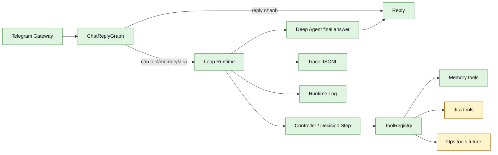

# Kiến Trúc Niko Loop

Ngày cập nhật: 2026-10-08
Phạm vi: kiến trúc Loop tổng quát cho Niko Agent; core V0 đã có, nhưng chưa phải tool router hoàn chỉnh

Tài liệu này mô tả Loop như một slot xử lý tool có thể dùng chung cho chat
memory, Jira/business data và các workflow cần nhiều bước về sau. Hiện tại Niko
vẫn chạy bằng `ChatReplyGraph` viết tay; `niko/loop/` đã có core V0 độc lập,
`niko/tools/memory/facts.py` đã có fact tools V0, `niko/tools/jira/issues.py` đã
có Jira fixture tools read-only V0, `niko/graphs/jira_issue/` đã có Jira issue
context flow V0, và memory correction có bridge V0 default-off qua Loop. Đây
chưa phải tool router hoàn chỉnh cho mọi chat/Jira workflow.

Lưu ý ranh giới: `niko/loop/` không phải gateway runner, app assembly hay lớp
chọn workflow cấp turn. Loop chỉ chạy một workflow tool nhiều bước sau khi lớp điều phối
đã quyết định cần dùng tool. Kế hoạch khảo sát tách các lớp core/gateway/graph
nằm ở `docs/plans/2026-10-08-niko-core-split-survey.md`; phương hướng triển khai
theo phase nằm ở `docs/plans/2026-10-08-niko-core-split-implementation-plan.md`.

## 1. Vai Trò Của Loop

Loop là vòng lặp:

```text
observe -> reason -> act -> observe -> ... -> final reply
```

Trong Niko:

- `observe`: nhận current prompt, recent working memory, long-term memory, tool
  result và gateway metadata.
- `reason`: một controller quyết định cần dùng tool nào, dùng tham số gì, hay đã
  đủ thông tin để trả lời.
- `act`: Python runtime gọi tool thật, validate guardrail và ghi trace.
- `final reply`: agent trả lời user từ context đã thu thập, không để tool tự gửi
  Telegram message.

Tham chiếu Waku: graph có thể bọc quanh loop, nhưng không thay thế loop. Graph
quyết định đường đi lớn; loop xử lý những tác vụ cần model/controller gọi tool
lặp lại.

## 2. Ranh Giới Với Kiến Trúc Hiện Tại



Ranh giới cần giữ:

- `bots/telegram/` chỉ làm IO/auth/parsing/reply/sticker.
- `ChatReplyGraph` chọn route và gọi Loop khi tác vụ cần tool workflow.
- `niko/loop/` là nơi đặt loop core V0, tool registry, loop result và observer.
- `niko/memory/` vẫn sở hữu SQLite memory và guardrail mutate memory.
- Tool chỉ trả về kết quả cho loop; tool không tự reply Telegram.
- Trace/runtime log nằm ở harness/ops, không tham gia reasoning.

## 3. Interface Mục Tiêu

Đây là interface V0 hiện có trong `niko/loop/`.

```python
@dataclass(frozen=True)
class Tool:
    name: str
    description: str
    input_schema: dict[str, object]
    handler: Callable[[dict[str, object], ToolContext], ToolResult]
    mutates_state: bool = False


@dataclass(frozen=True)
class ToolResult:
    ok: bool
    text: str
    data: dict[str, object]
    error: str = ""


@dataclass(frozen=True)
class LoopResult:
    reply: str
    tool_calls: list[dict[str, object]]
    iterations: int
    limit_reached: bool
    error: str = ""
```

`ToolRegistry` cần hỗ trợ:

- đăng ký tool theo tên duy nhất;
- xuất schema cho controller/model;
- execute tool theo `{name, args}`;
- bắt lỗi tool thành `ToolResult(ok=False, ...)` để loop không crash;
- ghi rõ tool nào mutate state để observer/trace có thể đánh dấu.

`LoopObserver` hiện ghi các event tối thiểu tới trace/runtime log:

- `loop_started`
- `loop_decision`
- `loop_tool_call_started`
- `loop_tool_call_finished`
- `loop_final_answer`
- `loop_limit_reached`
- `loop_error`

## 4. Controller V0 Và Future Tool Use

Niko hiện gọi Claude qua `fcc-claude` CLI, không gọi trực tiếp Messages API
tool-use trong application code. Vì vậy Loop cần có hai chế độ được tài liệu hóa
rõ:

- V0: Python-controlled loop. Controller có thể là Decision Model/Ollama hoặc
  một prompt JSON qua Fast/Deep command. Python parse label/tool/action, validate
  schema, gọi tool và tiếp tục vòng lặp.
- Future: native LLM tool-use. Nếu runtime sau này có structured tool calls ổn
  định, Loop có thể thay controller bằng native tool-use mà vẫn giữ ToolRegistry,
  ToolResult, observer và trace event.

Mặc định triển khai gần nhất nên chọn V0 để hợp với runtime hiện tại và để debug
được trên dashboard.

## 5. Use Case Đầu Tiên: Memory Correction

Memory correction mặc định vẫn là Phase 5 V1 tạm thời trong
`niko/memory/correction_workflow.py`: gate nhận diện intent, Python search fact,
hỏi lại khi mơ hồ, pending ID được lưu trong SQLite với TTL 15 phút, rồi
update/delete SQLite.

Phase 4A đã thêm bridge default-off trong `niko/memory/correction_loop.py`. Khi
bật `NIKO_MEMORY_CORRECTION_LOOP_ENABLED=1`, correction prompt trực tiếp được đưa
qua LoopRuntime + fact tools sau correction gate; nếu loop lỗi thì fallback về
V1. Pending ambiguous fact-ID follow-up vẫn đi qua facade V1 để giữ hành vi
live-test ổn định, nhưng state chờ chọn fact đã bền qua restart.

Hướng hoàn chỉnh hơn là chuyển correction thành workflow tool có state bền:

```text
user prompt
  -> NikoApp selects memory correction workflow before normal chat
  -> Loop controller chooses search_facts/list_facts
  -> tool result returns candidate fact IDs
  -> controller chooses clarify/update_fact/delete_fact/final reply
  -> Python guardrail validates ID and mutates SQLite
  -> trace/runtime log captures each step
```

Tool V0 nên gồm:

- `search_facts`: đã có adapter, tìm fact theo query và trả ID/subject/content/source/meta.
- `list_facts`: đã có adapter, liệt kê fact gần đây theo limit.
- `update_fact`: đã có adapter, chỉ mutate khi ID hợp lệ và subject/content không rỗng.
- `delete_fact`: đã có adapter, chỉ mutate khi ID hợp lệ.

Episode nên tiếp tục read-only trong V0 để tránh mất ngữ cảnh lịch sử.

## 6. Mở Rộng Jira Và Business Tools

Jira có ba lane cần tách rõ:

- Runtime Jira tools trong `niko/tools/jira/`: đọc Jira/mock Jira theo yêu cầu của
  graph, hiện là fixture read-only V0.
- Jira bot/gateway tương lai: chạy ở phía Jira để nhận/sync event hoặc thao tác
  trên Jira.
- Lakehouse/KG: tầng dữ liệu phân tích dài hạn ở repo riêng, không phải nơi tool
  V0 bắt buộc ghi vào.

Runtime Jira tools không trộn dữ liệu vào chat memory SQLite mặc định. Bộ V0 gồm:

- `parse_issue_key`: xác định issue key từ prompt.
- `fetch_jira_issue`: lấy issue summary/description/status/assignee.
- `fetch_jira_comments`: lấy comment liên quan.
- `fetch_jira_changelog`: lấy lịch sử thay đổi nếu cần phân tích tiến độ.

Luôn để Deep agent phân tích dựa trên context đã normalize và có evidence. Tool
chỉ fetch/normalize dữ liệu; tool không tự sinh nhận định cuối cùng.

Phase 6B đã nối bộ tool này vào chat graph khi `NIKO_JIRA_TOOLS_ENABLED=1`:

```text
prompt có issue key
  -> ChatReplyGraph
  -> JiraIssueAnalysisWorkflow
  -> LoopRuntime gọi parse/fetch issue/comment/changelog
  -> context có source/evidence
  -> Deep agent phân tích
```

Nếu issue key không có trong fixture, graph trả reply an toàn và không gọi Deep.
Fixture path có thể đổi bằng `NIKO_JIRA_FIXTURE_PATH`; loop tối thiểu dùng
`NIKO_JIRA_LOOP_MAX_ITERATIONS=5`.

Phase 6C thêm Jira Decision Gate default-off cho vùng mơ hồ:

```text
prompt không có issue key rõ nhưng có tín hiệu Jira/task
  -> Decision Model chọn use_jira_tool / ask_for_issue_key / skip_jira
  -> Python vẫn parse/validate issue key
  -> có issue key hợp lệ thì chạy JiraIssueAnalysisWorkflow
  -> thiếu key thì hỏi user gửi mã issue
```

Issue key rõ vẫn đi rule Python, không cần hỏi model. Nếu gate lỗi hoặc confidence
thấp hơn `NIKO_JIRA_DECISION_CONFIDENCE_THRESHOLD`, graph fallback về route chat cũ.

## 7. Guardrails

- Max iteration default cho V0 nên nhỏ, vì local demo cần quan sát được và tránh
  kẹt loop. Giá trị đề xuất: `3` cho memory correction, `5` cho Jira fetch flow.
- Khi đạt max iteration, Loop phải gọi final answer/fallback không gọi thêm tool.
- Tool mutate state phải ghi trace trước và sau khi mutate.
- Tool lỗi phải trả về result lỗi cho Loop; không làm mất chat log.
- Nếu controller trả tool/action không hợp lệ, Loop fail-closed với mutate tool
  và có thể fail-open với read-only retrieval tool.
- Dashboard/trace phải nhìn được từng tool call để debug quyết định của model.

## 8. Trạng Thái Triển Khai

| Thành phần | Trạng thái |
| --- | --- |
| ChatReplyGraph route/Fast/Deep | đã có |
| MemoryRuntime retrieval/write/correction facade | đã có |
| Memory correction V1 tạm thời | đã có |
| Tool slot trên dashboard | đã có về mặt hiển thị |
| Loop core `niko/loop/` | done V0 |
| ToolRegistry tổng quát | done V0 |
| Memory fact tools qua Loop | done V0 adapter under `niko/tools/memory/` |
| Memory correction qua Loop | V0 default-off, fallback về V1, pending follow-up bền trong SQLite nhưng facade vẫn V1 |
| Loop dashboard observability | done V0: trace có Loop Steps theo turn, runtime log source `loop` có message từng decision/tool |
| Jira fixture tools qua Loop | done V0 adapter under `niko/tools/jira/` |
| Jira issue context flow | done V0 under `niko/graphs/jira_issue/`, default-off by `NIKO_JIRA_TOOLS_ENABLED` |
| Jira Decision Gate | done V0 default-off by `NIKO_JIRA_DECISION_GATE_ENABLED`; model only chooses gate labels |
