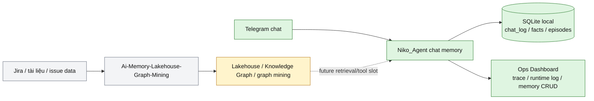
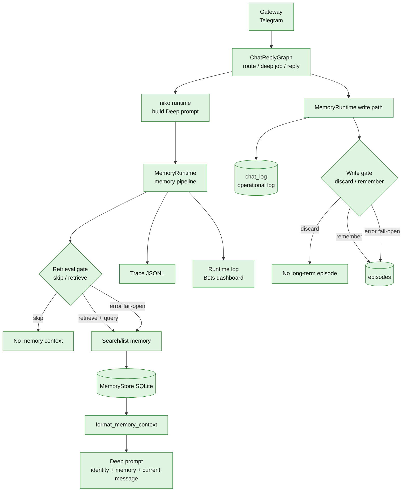
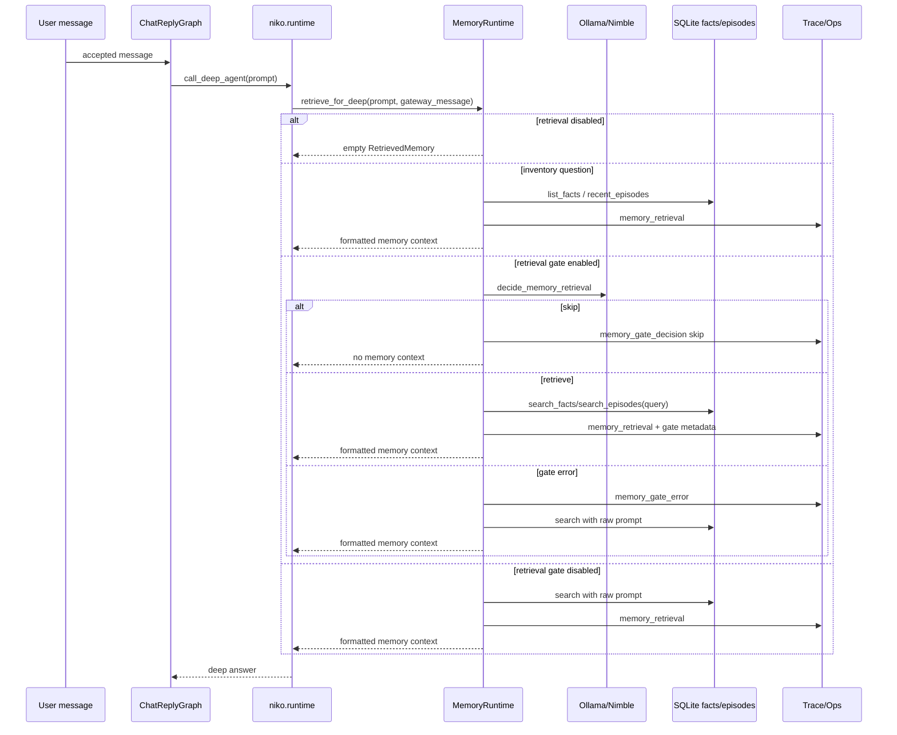
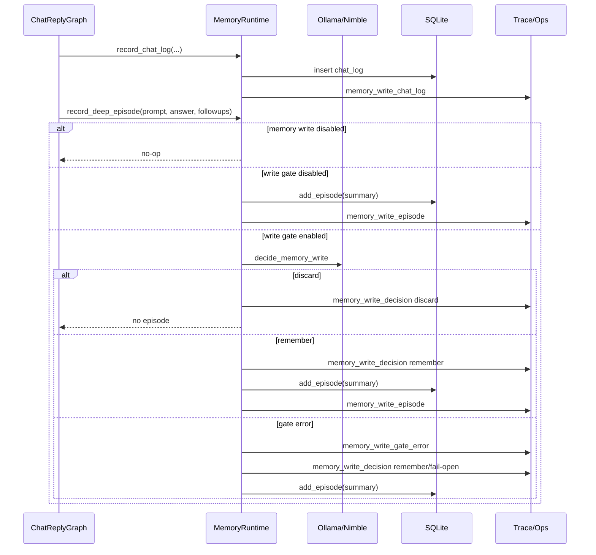
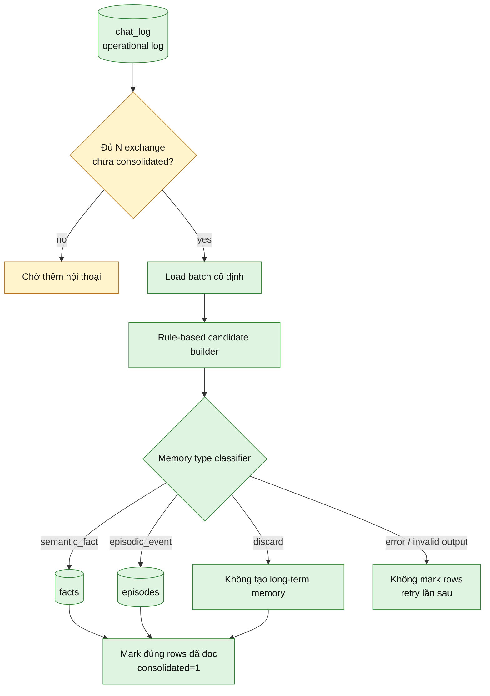
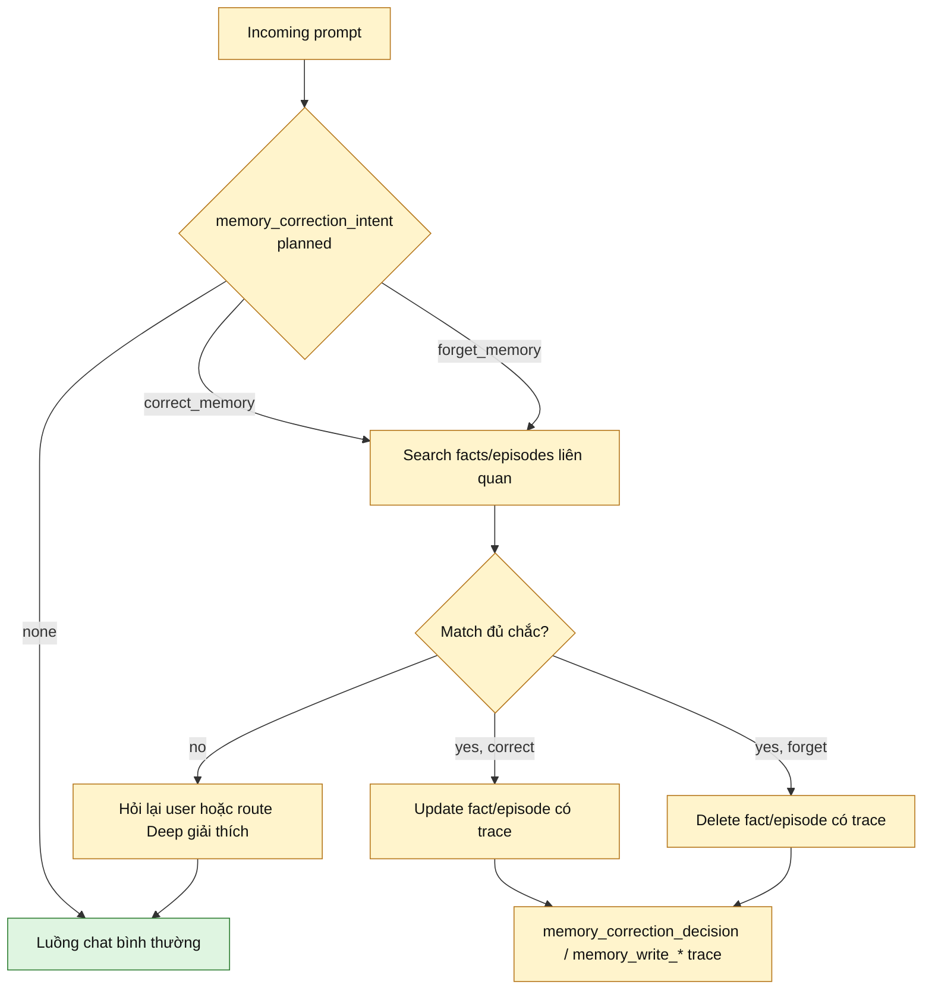
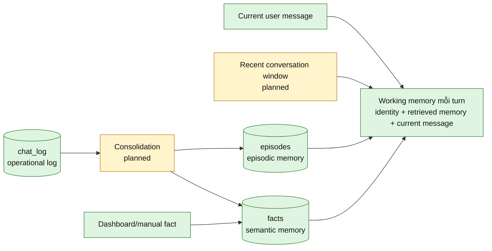

# Chat Memory Architecture Flow

Ngày cập nhật: 2026-10-07
Phạm vi: chat memory local của Niko Agent, single-user v1

Tài liệu này là bản sơ đồ kiểm soát luồng memory. Nó gom lại trạng thái hiện tại
và kiến trúc muốn xây theo kế hoạch trong `docs/plans/2026-10-07-chat-memory-decision-model.md`.
Mục tiêu là nhìn vào đây để biết dữ liệu đi qua đâu, quyết định nào do model nhỏ
phụ trách, phần nào đã có, phần nào còn là phase sau.

## Legend

- `done`: đã có trong code hiện tại.
- `planned`: hướng muốn xây tiếp, chưa hoàn chỉnh.
- `boundary`: ranh giới không nên trộn vào chat memory v1.

## 1. Ranh Giới Lớn

Chat memory của Niko là lane local cho tương tác Telegram. Lakehouse/Jira là lane
business memory riêng, chỉ nên nối vào khi cần dữ liệu issue/tài liệu, không dùng
làm nơi lưu mặc định cho mọi tin nhắn Telegram.

## 2. Kiến Trúc Memory Runtime

Điểm kiểm soát chính là `MemoryRuntime`. Graph và runtime không nên tự biết chi
tiết gate/search/write nữa; chúng chỉ gọi pipeline memory.

## 3. Retrieval Flow Cho Deep

Nguyên tắc: retrieval gate lỗi thì fail-open, vì bỏ lỡ memory cần thiết thường tệ
hơn việc retrieve hơi dư. Fast triage không nhận memory context để giữ route JSON sạch.

## 4. Write Flow Hiện Tại

Write gate v1 chỉ chặn `episodes`. `chat_log` vẫn là operational log để debug,
dashboard và consolidation sau này có nguyên liệu.

## 5. Target Flow: Consolidation

Scaffold consolidation hiện đã có: `chat_log` có `consolidated`, store đọc được batch
chưa xử lý, tạo candidate bảo thủ, dùng classifier `semantic_fact` / `episodic_event`
/ `discard`, ghi facts/episodes với provenance `consolidation`, và có API dashboard
để chạy thủ công. Phần chưa làm là threshold/scheduler tự động và summarizer tự do;
guardrail hiện tại vẫn là: classifier lỗi thì không mark row đã consolidate.

## 6. Target Flow: Correction / Forget Memory

Deep agent không nên tự sửa/xóa memory tùy ý. Correction cần search lấy record ID
trước, rồi mới update/delete có trace.

## 7. Các Lớp Dữ Liệu

`chat_log` không phải semantic/episodic memory. Nó là log vận hành và nguyên liệu
cho consolidation. Long-term memory hiện nằm ở `facts` và `episodes`.

## 8. Trạng Thái Theo Phase

| Phase | Mục tiêu | Trạng thái |
| --- | --- | --- |
| 0 | Ranh giới chat memory vs lakehouse/Jira | done |
| 0.5 | `MemoryRuntime` làm cổng pipeline trung tâm | done |
| 1 | Decision model memory tasks | retrieval/write done, classifier/correction planned |
| 2 | Retrieval gate cho Deep | done, default-off |
| 3 | Unicode/query search hardening | done |
| 4 | Write gate và consolidation | write gate done, manual consolidation candidate/classifier done, auto threshold planned |
| 5 | Correction/forget qua chat/dashboard | planned |
| 6 | Working memory rõ: recent/current/long-term | planned |
| 7 | Eval riêng cho memory | partial tests done, eval scenarios planned |

## 9. Nguyên Tắc Kiểm Soát

1. Telegram gateway không chứa logic memory.
2. `ChatReplyGraph` điều phối flow chat, nhưng không ôm policy retrieval/write.
3. `MemoryRuntime` là cổng chính cho memory pipeline.
4. Decision model chỉ trả label/query/reason, không tự ghi database.
5. SQLite là source of truth cho v1.
6. `chat_log` luôn là operational log; write gate chỉ chặn long-term `episodes`.
7. Retrieval gate lỗi thì fail-open để không bỏ lỡ memory cần dùng.
8. Write/consolidation/correction lỗi thì không được làm mất log vận hành.
9. Mọi quyết định memory phải có trace/runtime log đủ đọc.
10. Multi-user scoped memory và lakehouse/Jira retrieval không nằm trong v1 mặc định.
