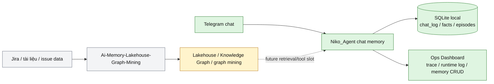
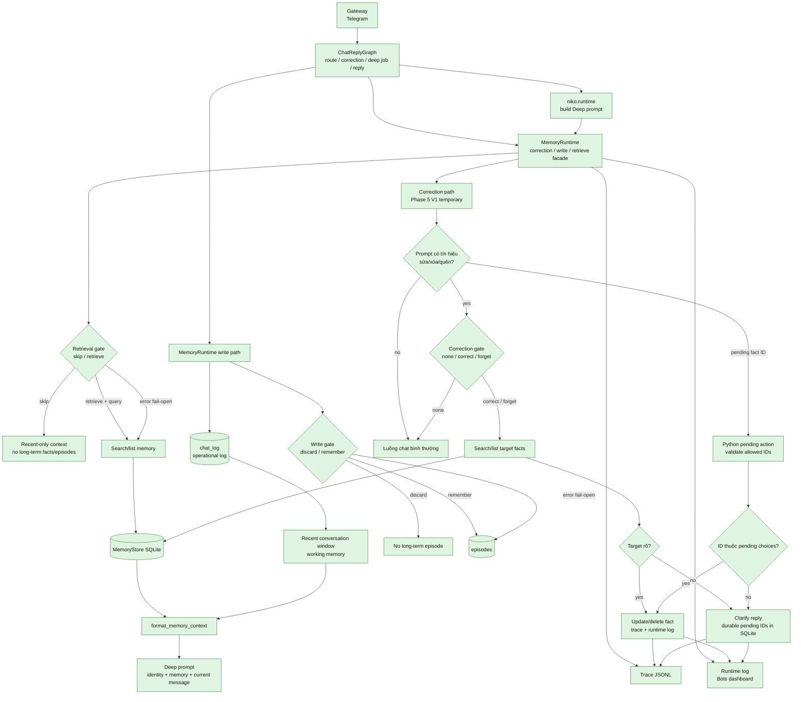
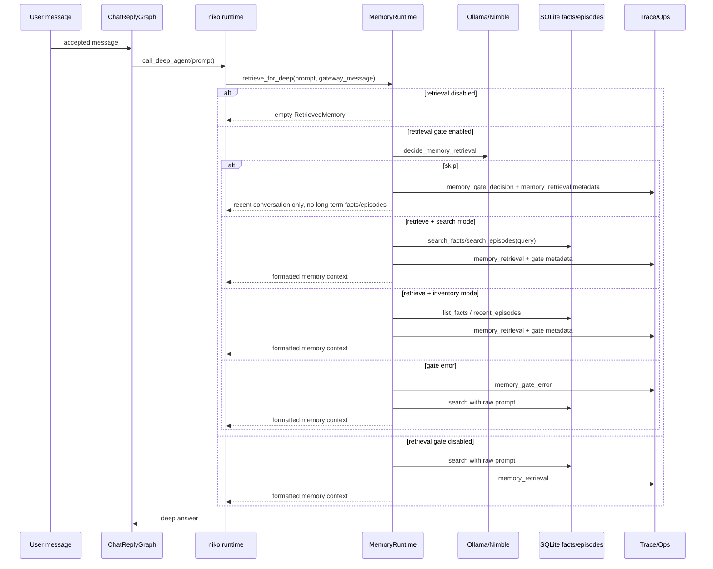
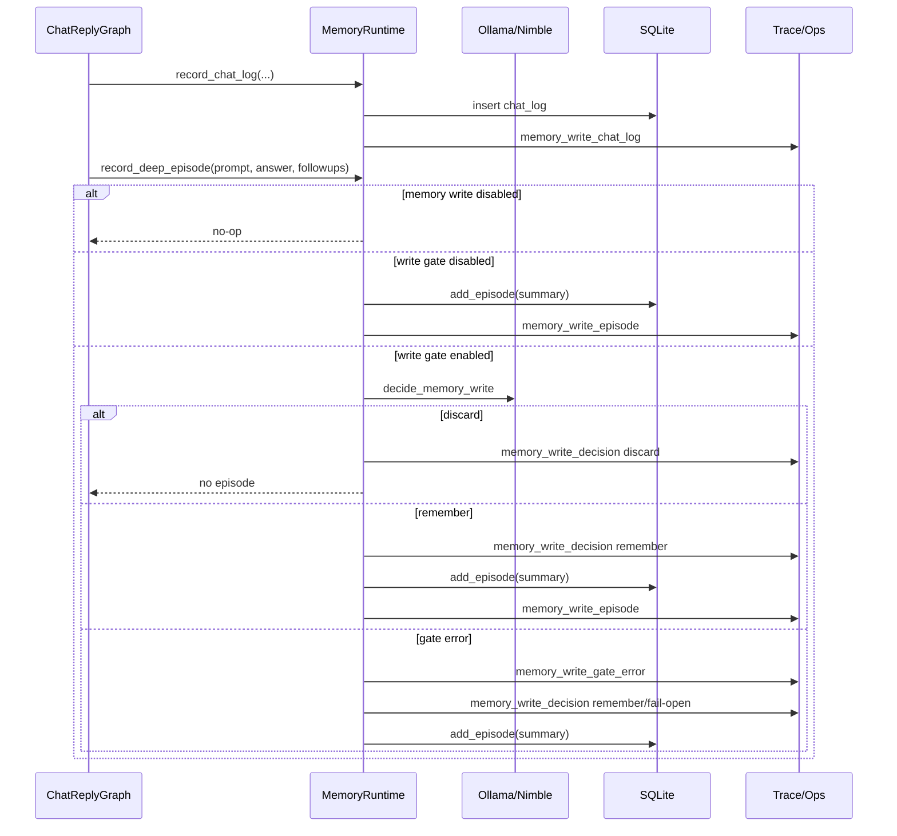
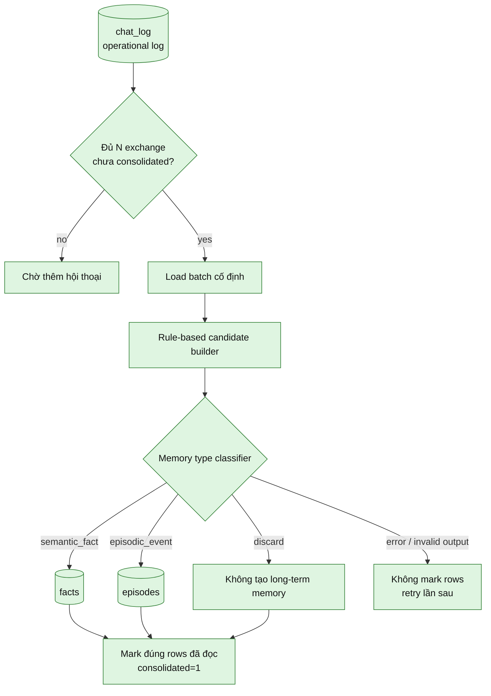
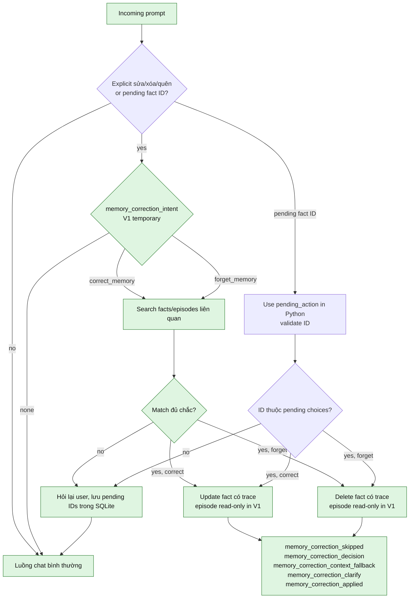
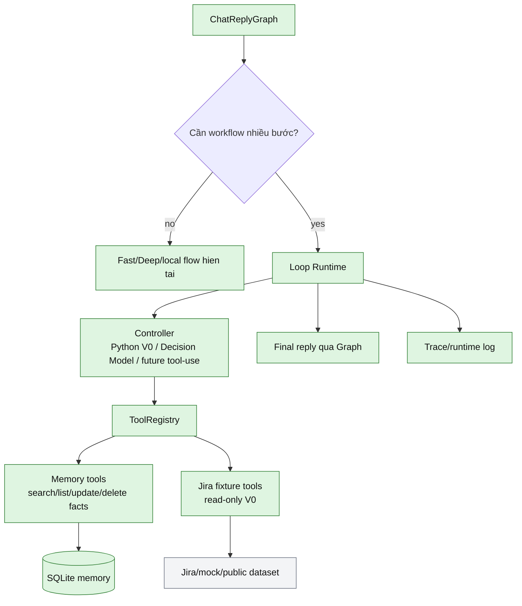
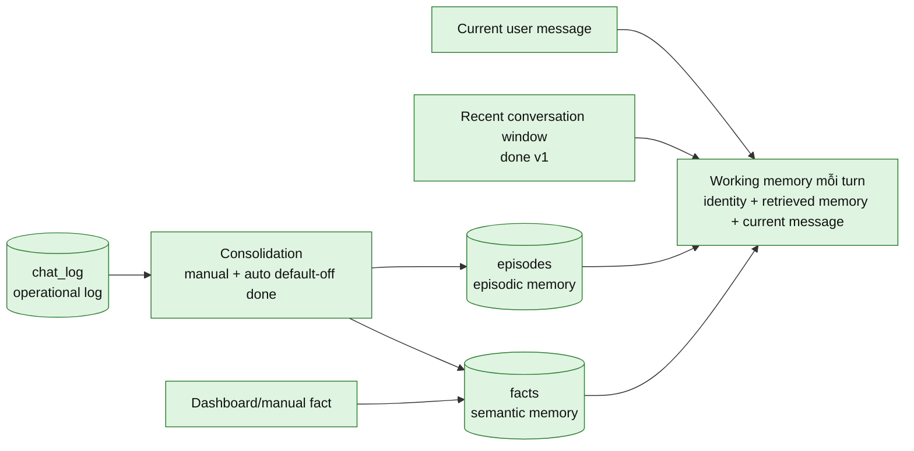

# Chat Memory Architecture Flow

Ngày cập nhật: 2026-10-08
Phạm vi: chat memory local của Niko Agent, single-user v1

Tài liệu này là bản sơ đồ kiểm soát luồng memory. Nó gom lại trạng thái hiện tại
và kiến trúc muốn xây theo kế hoạch trong `docs/plans/2026-10-07-chat-memory-decision-model.md`.
Mục tiêu là nhìn vào đây để biết dữ liệu đi qua đâu, quyết định nào do model nhỏ
phụ trách, phần nào đã có, phần nào còn là phase sau.

Nhật ký live verification chính nằm ở `docs/harness/memory-live-verification.md`.
Checklist Phase 6/7 ngày 2026-10-07 hiện được giữ như bản historical để đối chiếu
expected/result cũ; checklist Loop hiện tại nằm ở
`docs/plans/2026-10-08-niko-loop-implementation-checklist.md`.

## Legend

- `done`: đã có trong code hiện tại.
- `planned`: hướng muốn xây tiếp, chưa hoàn chỉnh.
- `V1 temporary`: đã chạy trong baseline, nhưng cố ý giữ nhẹ để sau này chuyển
  sang Loop/tool workflow.
- `boundary`: ranh giới không nên trộn vào chat memory v1.

## 1. Ranh Giới Lớn

Chat memory của Niko là lane local cho tương tác Telegram. Lakehouse/Jira là lane
business memory riêng, chỉ nên nối vào khi cần dữ liệu issue/tài liệu, không dùng
làm nơi lưu mặc định cho mọi tin nhắn Telegram.

## 2. Kiến Trúc Memory Runtime

Điểm kiểm soát chính là `MemoryRuntime`. Graph và runtime không nên tự biết chi
tiết gate/search/write/correction nữa; chúng chỉ gọi pipeline memory.

Luồng hiện tại có hai điểm gọi chính vào `MemoryRuntime`: `ChatReplyGraph` gọi trực
tiếp để xử lý correction/write và ghi `chat_log`; `niko.runtime` gọi khi cần dựng
memory context cho Deep. Vì vậy correction gate không nằm bên trong Deep runtime.

## 3. Retrieval Flow Cho Deep

Nguyên tắc: retrieval gate lỗi thì fail-open, vì bỏ lỡ memory cần thiết thường tệ
hơn việc retrieve hơi dư. Khi gate trả `skip`, runtime chỉ bỏ qua long-term
`facts/episodes`; recent conversation window vẫn có thể được inject như working memory
ngắn hạn cho Deep. Fast triage không nhận memory context để giữ route JSON sạch.

Inventory không còn bypass gate bằng keyword Python. Câu kiểu "đang lưu fact nào"
vẫn đi qua Decision Model; model chọn `list_facts`, `recent_episodes`, hoặc trả
`fact_mode=list` / `episode_mode=recent` để MemoryRuntime thực thi bằng store.

## 4. Write Flow Hiện Tại

Write gate v1 chỉ chặn `episodes`. `chat_log` vẫn là operational log để debug,
dashboard và manual/auto consolidation có nguyên liệu.

## 5. Target Flow: Consolidation

Scaffold consolidation hiện đã có: `chat_log` có `consolidated`, store đọc được batch
chưa xử lý, tạo candidate bảo thủ, dùng classifier `semantic_fact` / `episodic_event`
/ `discard`, ghi facts/episodes với provenance `consolidation`, và có API dashboard
để chạy thủ công. Auto consolidation default-off đã có threshold theo complete
exchange, background worker và lock chống chạy trùng. Phần chưa làm là summarizer
tự do; guardrail hiện tại vẫn là: classifier lỗi thì không mark row đã consolidate.

Trong code hiện tại:

- `Refresh batch` chỉ đọc batch/candidate kế tiếp để quan sát, không ghi gì.
- `Run once` xử lý đúng một batch và mark những row đã đọc nếu classifier hợp lệ.
- `NIKO_MEMORY_CONSOLIDATION_AUTO_ENABLED=1` cho phép `MemoryRuntime` trigger
  background worker sau assistant reply thật, khi đủ
  `NIKO_MEMORY_CONSOLIDATE_EVERY_N_EXCHANGES`.
- `deep_agent_wait` và `busy_reply` không tính là assistant reply hoàn tất.

## 6. Target Flow: Correction / Forget Memory

Deep agent không nên tự sửa/xóa memory tùy ý. Correction cần search lấy record ID
trước, rồi mới update/delete có trace. Decision Model ở correction gate chỉ trả
intent/query/replacement; Python runtime mới validate target và mutate SQLite.
Precheck ở đầu luồng giữ `current_prompt` làm bằng chứng chính: nếu prompt không có
tín hiệu sửa/xóa/quên và không phải reply chọn pending fact ID, runtime bỏ qua
correction gate để recent history cũ không kéo sai intent. Pending lựa chọn fact ID
được lưu bền trong SQLite với TTL 15 phút, nên follow-up kiểu `fact #8 nhé` vẫn
resolve được sau khi runtime/dashboard restart. Phase 5 V1 hiện đủ làm baseline tạm
cho chat memory local; khi Loop/tool slot trưởng thành, phần confirm target và
mutate memory nên chuyển tiếp thành workflow/tool rõ contract hơn thay vì mở rộng
thêm logic chat ad-hoc.

Phase 4A của Loop đã thêm một đường thử nghiệm default-off: khi bật
`NIKO_MEMORY_CORRECTION_LOOP_ENABLED=1`, correction prompt trực tiếp đi qua
`MemoryCorrectionLoopWorkflow` sau correction gate. Loop dùng `search_facts`,
`update_fact`, `delete_fact` để xử lý target rõ, hỏi lại khi match mơ hồ hoặc
thiếu replacement, và fallback về V1 nếu loop lỗi. Follow-up chỉ chọn pending
fact ID vẫn đi qua facade V1 để giữ hành vi live-test hiện tại ổn định, nhưng
pending state đã được lưu trong bảng `memory_correction_pending`.
Nếu Decision Model nhận đúng intent nhưng bỏ trống `query`, runtime trích target
từ prompt kiểu `quên fact ...` / `sửa fact ...`. Loop chỉ tự chọn một fact khi
query đủ cụ thể và một candidate vượt trội; query ngắn hoặc cùng điểm vẫn hỏi
lại để tránh xóa nhầm. Trước khi hỏi lại, Loop còn lọc candidate quá yếu: nếu
search chỉ khớp các từ chung như `thích` nhưng không khớp nội dung đặc trưng của
target, kết quả được coi là `no_fact_match` thay vì bắt user chọn ID.

## 6.5 Target Flow: Generic Loop / Tool Workflow

Loop core V0 đã có trong `niko/loop/`, fact tool adapters đã có trong
`niko/tools/memory/facts.py`, và Jira fixture tools đã có trong
`niko/tools/jira/issues.py`. File cũ `niko/memory/loop_tools.py` đã được xóa để tránh nhập nhằng import. Bridge correction V0 default-off đã nối memory tools
vào correction prompt trực tiếp. Phase 6B đã thêm `niko/graphs/jira_issue/` để
fetch issue/comment/changelog qua Loop, format context có evidence và đưa sang
Deep khi bật `NIKO_JIRA_TOOLS_ENABLED=1`. Phase 6C thêm Jira Decision Gate
default-off để Nimble chỉ phân loại prompt Jira mơ hồ trước khi Python validate
issue key và gọi tool. Pending fact-ID follow-up hiện đã có state bền
trong SQLite, nhưng phần điều phối memory correction vẫn là facade V1 chứ chưa phải tool router tổng
quát cho chat. Tài liệu triển khai nằm ở
`docs/loop/architecture.md` và checklist ở
`docs/plans/2026-10-08-niko-loop-implementation-checklist.md`. Khi Loop trưởng
thành, correction V1 trong section 6 nên chuyển dần thành memory tool workflow có
state rõ contract hơn: controller chọn search/list/update/delete, Python validate
target rồi mới mutate SQLite. Jira/business tools hiện vẫn read-only và không trộn dữ liệu
Jira vào chat memory SQLite mặc định.

## 7. Các Lớp Dữ Liệu

`chat_log` không phải semantic/episodic memory. Nó là log vận hành và nguyên liệu
cho consolidation. Long-term memory hiện nằm ở `facts` và `episodes`.

## 8. Trạng Thái Theo Phase

| Phase | Mục tiêu | Trạng thái |
| --- | --- | --- |
| 0 | Ranh giới chat memory vs lakehouse/Jira | done |
| 0.5 | `MemoryRuntime` làm cổng pipeline trung tâm | done |
| 1 | Decision model memory tasks | retrieval/write/classifier done, correction V1 temporary |
| 2 | Retrieval gate cho Deep | done, live-verified, default-off |
| 3 | Unicode/query search hardening | done |
| 4 | Write gate và consolidation | write gate done, manual path live-verified, auto threshold default-off done, summarizer planned |
| 5 | Correction/forget qua chat/dashboard | V1 temporary, delete/update/ambiguous/precheck skip live-verified; Loop V0 default-off live-tested; ambiguous follow-up có pending SQLite TTL 15 phút |
| 6 | Working memory rõ: recent/current/long-term | done v1 |
| 7 | Eval riêng cho memory | done v1: deterministic eval scenarios + unit tests |

## 9. Nguyên Tắc Kiểm Soát

1. Telegram gateway không chứa logic memory.
2. `ChatReplyGraph` điều phối flow chat, nhưng không ôm policy retrieval/write.
3. `MemoryRuntime` là cổng chính cho memory pipeline.
4. Decision model chỉ trả label/mode/query/reason, không tự ghi database.
5. SQLite là source of truth cho v1.
6. `chat_log` luôn là operational log; write gate chỉ chặn long-term `episodes`.
7. Retrieval gate lỗi thì fail-open để không bỏ lỡ memory cần dùng.
8. Write/consolidation/correction lỗi thì không được làm mất log vận hành.
9. Auto consolidation phải default-off, có threshold complete exchange, lock và
   trace/runtime log trước khi nối vào chat flow.
10. Mọi quyết định memory phải có trace/runtime log đủ đọc.
11. Multi-user scoped memory và lakehouse/Jira retrieval không nằm trong v1 mặc định.
